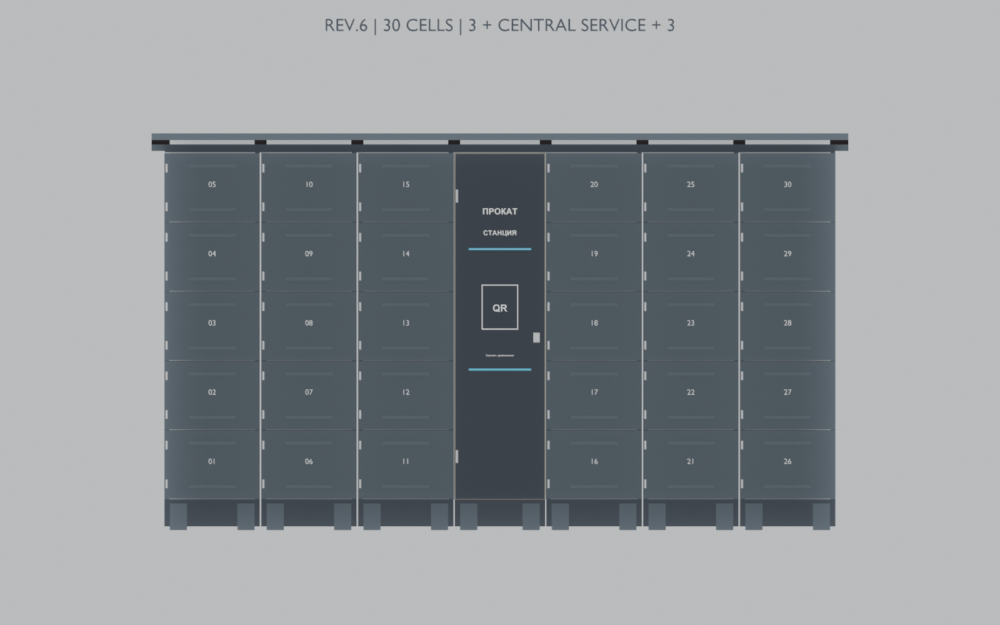
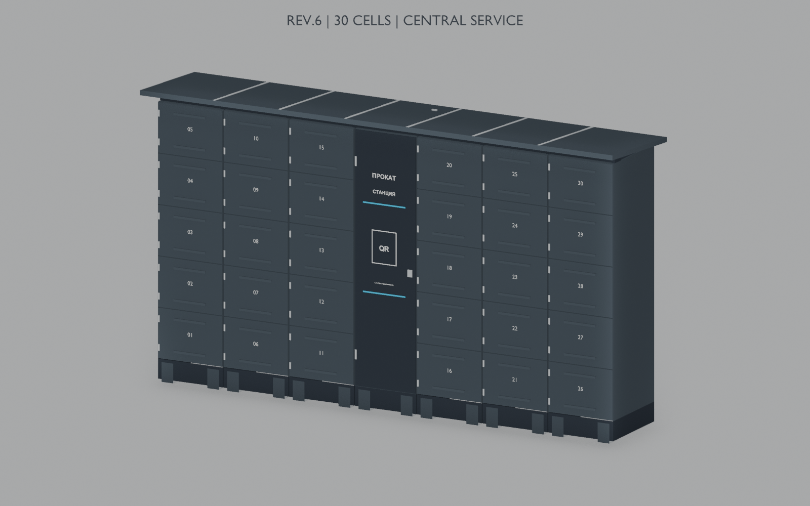
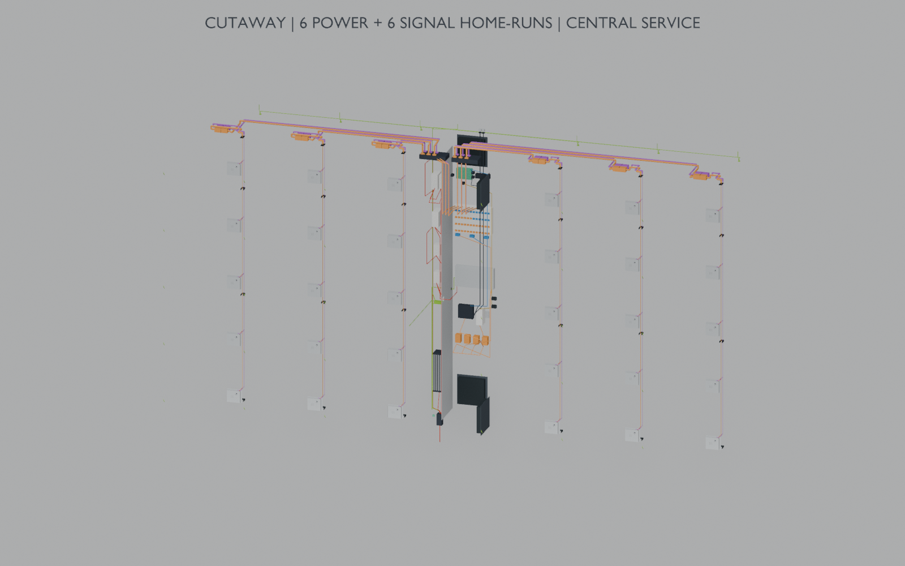
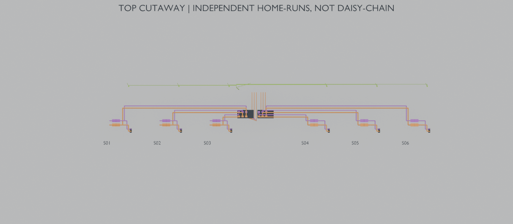
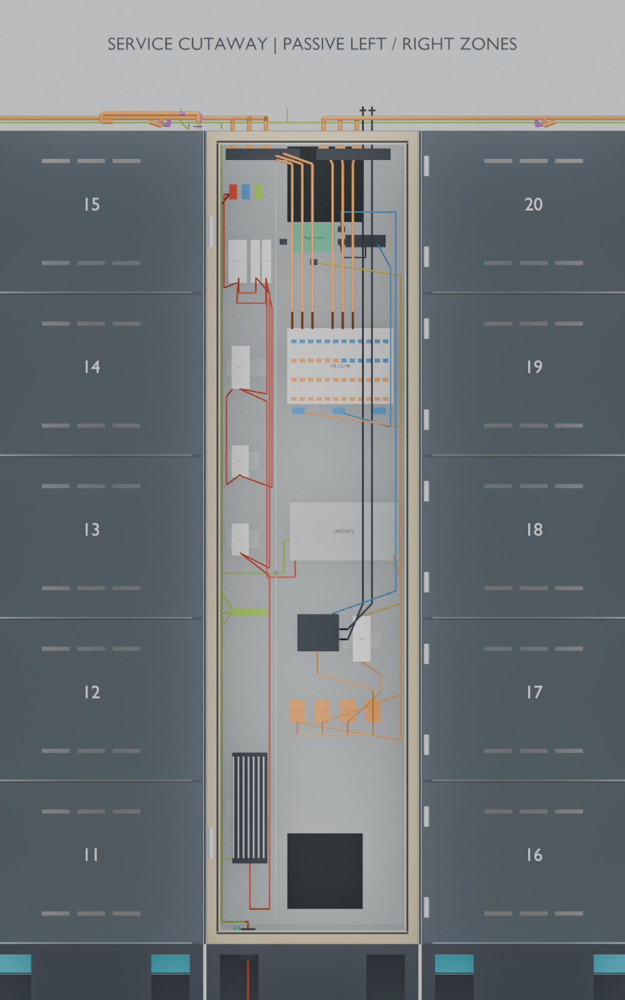

# Уличный постамат для проката коньков — Rev.6, 30 ячеек

**Пакет для заводской проверки, разработки рабочей документации и изготовления опытного образца.**

Дата передачи: 01.10.2026. Единственный вариант этого репозитория: **6 секций × 5 ячеек, центральный SERVICE; 3 + SERVICE + 3**. Компоновка и внешний вид приняты заказчиком как база; изменения согласовывать при наличии расчётного, технологического или испытательного обоснования.

**Это компоновочная инженерная модель, а не готовая КД для резки и сборки без доработки.** Пройдены геометрические проверки. Электробезопасность, прочность, ресурс, герметичность и зимняя работоспособность готового изделия ещё не подтверждены. Реестр ниже содержит открытые вопросы, а не утверждение о наличии каждого описанного дефекта.



## 1. Что передаётся

| Файл | Назначение |
|---|---|
| [postamat_rev6_30.blend](postamat_rev6_30.blend) | Полная модель Rev.6 на 30 ячеек; размеры в метрах |
| [images/perspective.png](images/perspective.png) | Общий вид |
| [images/front.png](images/front.png) | Фасад и компоновка |
| [images/wiring.png](images/wiring.png) | Технический разрез с трассами; скрытые стенки не означают отсутствие ограждений |
| [images/service.png](images/service.png) | SERVICE со снятыми для иллюстрации дверью/экранами; не эксплуатационное положение |
| [images/top_cable_routing.png](images/top_cable_routing.png) | Разводка шести независимых секционных жгутов сверху |
| [validation.json](validation.json) | Отчёт геометрической проверки повторно открытой модели |
| README.md | Размеры, состав, электрическая концепция, кабели, реестр рисков и программа работ |

Архивы старых итераций, альтернативные размеры постамата, резервные .blend1 и рабочие временные файлы в поставку не входят. Параметрический исходный проект остаётся у заказчика; его генератор зависит от архивной базы и поэтому не включён как якобы самостоятельный скрипт. Для повторной генерации изменений обращаться к заказчику. Заводу нужно разработать собственную рабочую листовую CAD-модель и КД по согласованной конструкции. STEP/DXF-развёртки этим пакетом не предоставляются.

Исходный DOCX-ТЗ не включён: настоящий README задаёт рамки этой конкретной передачи. Новые испытательные предложения в реестре не объявляются ранее утверждёнными требованиями ТЗ; критерии и ответственность согласовать до работ.

## 2. Назначение и размеры

Хранение одной пары коньков в каждой из 30 отдельных запираемых ячеек. Металлическое уличное исполнение, простые детали из листа для резки, гибки и сварки. Экран, банковский терминал и ККТ в состав не входят. QR на фасаде — место под будущую действительную ссылку, не действующий сервис.

| Параметр | Значение модели / статус |
|---|---|
| Количество | 30 ячеек / дверей / замков / ответных частей |
| Секции | 6 по 5 ячеек вертикально |
| Компоновка | 3 секции + SERVICE + 3 секции |
| Корпус, Ш × Г × В | **3120 × 530 × 1761,2 мм** |
| Общий габарит с крышей, Ш × Г × В | **3240 × 700 × 1853,9 мм**; без будущих антенн |
| Полезная ячейка, Ш × В × Г | **400 × 300 × 450 мм** |
| Шаг секций внутри группы | 450 мм |
| SERVICE | Ширина 420 мм, центр по ширине x = 1560 мм |
| SERVICE без цоколя, Ш × Г × В | Около 420 × 530 × 1611,2 мм |
| Внутренний SERVICE, Ш × Г × В | Около 365 × 435 × 1556 мм; не сплошной свободный объём после установки устройств |
| Лист корпуса / двери / крыша | Предварительно 1,2 / 1,5 / 1,5 мм; требуется расчёт жёсткости |
| Утепление SERVICE | 25 мм; материал и теплотехника не утверждены |
| Поддоны | 30 шт., уклон 1,7° назад, перепад около 13,4 мм |
| Задняя зона дренажа | Около 25 мм, 6 отдельных галерей |
| Ограничители дверей | 30 тросовых, расчётный угол 100° |
| Анкерные площадки | 14; 2 на секцию и 2 на SERVICE; анкеры не выбраны |
| Резервы охлаждения SERVICE | Два задних отверстия 150 × 150 мм с закрывающими панелями |
| Задняя зона доступа | Предварительно 250 мм; не нормативный/расчётный тепловой отступ |

Точность десятичных чисел относится к модели, а не к допускам изготовления. Нужны реальные допуски, учёт гибов, сварки и окраски. Габарит полезной ячейки проверить самой большой планируемой парой коньков через реальный дверной проём.



## 3. Конструкция, влажные зоны и доступ

- Секции съёмные по концепции; у каждой собственные POWER, SIGNAL и PE. Полная механическая стыковка, крепёж и монтажная последовательность требуют рабочих чертежей.
- Верхняя крыша имеет уклон и свесы. Уклон не доказывает допустимость снеговой нагрузки или самоочистку от снега.
- Каждая ячейка имеет пассивную вентиляцию с защитными элементами. Нет отдельного вентилятора или нагревателя ячейки. Высыхание мокрых коньков и отсутствие замерзания не гарантированы.
- Поддон направляет воду в отдельную галерею за своей секцией. Нижний выход направлен назад наружу. SERVICE геометрически отделён от мокрых зон. Герметичность швов, поведение при засоре/обледенении и отвод воды на площадке надо проверить физически.
- Проводка проходит в закрытой верхней магистрали и защищённой передней боковой зоне секций. Она должна оставаться недоступной пользователю с открытой дверью. Крепление крышек и устойчивость к доступу инструментом ещё требуют проверки.
- Под крышей находятся разъёмы секций. Для снятия секции отсоединяются её кабели, PE и механический крепёж. Крышки должны обеспечивать повторное уплотнение после обслуживания.
- В SERVICE сетевая часть отделена от низковольтной. Для сетевого входа LRS предусмотрен закрытый переход; геометрическое ограждение не заменяет электрический проект.
- Гибкие тросы и PE-перемычки показаны условно. Их форма при ручном вращении двери автоматически физически не пересчитывается.

## 4. Текущий состав оборудования

Количество ниже — установленное, без закупочного резерва. Выбор на уровне семейства/модели не означает подтверждённую совместимость всей системы.

| Оборудование | Кол-во | Статус / что уточнить |
|---|---:|---|
| KERONG KR-CU48 BOX | 1 | 30 каналов используются, 18 резервных; условный корпус 210 × 150 × 35 мм, паспорт и распиновка требуются |
| SARY / согласованный эквивалент, 12 В | 30 | Точный артикул, ответная часть, feedback, ток, холод и крепления не утверждены; корпус около 73 × 13 × 66 мм |
| Raspberry Pi 4 Model B, 4GB | 1 | Накопитель, образ ПО и узел питания требуют выбора/испытания |
| Teltonika RUT200 | 1 | Питание от защищённой ветви 12 В; SIM, антенны и коаксиалы уточнить |
| Waveshare USB TO RS485 (C) | 1 | Локальная связь Pi—KR; протокол KR не реализуется самим адаптером |
| MEAN WELL LRS-350-12 | 1 | 12 В, 29 А, 348 Вт по паспорту; нагрузка/ориентация/охлаждение проверить |
| MEAN WELL DDR-30G-5 | 1 | Преобразование 12 → 5 В для Pi; подключение и выходную защиту уточнить |
| MEYERTEC MTK-EH150 | 1 | Обогрев SERVICE 150 Вт; отступы, ток включения и эффективность проверить |
| SILART TBS-140 NC | 1 | Отопление, ориентир +10 °C; фактические пороги не утверждены |
| SILART TBS-240 NO | 1 | Разрешение питания электроники, ориентир +5 °C; гистерезис проверить |
| Контактор | 1 | Концепция: 2NO, катушка 230 В; ориентир Systeme C9C32225/эквивалент, окончательно согласовать |
| Вводная дифзащита / AC-ветви | 1 / 2 | Номиналы, характеристики и согласование не назначены |
| DC-защита MAIN / KR / DDR / RUT | 4 | Условные габариты; номиналы и защита отдельных выходов KR не подтверждены |
| POWER-разъёмы, комплектные пары | 6 | По 12 контактов: 10 рабочих + 2 резервных, артикул не выбран |
| SIGNAL-разъёмы, комплектные пары | 6 | По 12 контактов: 10 рабочих + 2 резервных, исключить перепутывание с POWER |
| Независимые дверные датчики | 0 | 30 резервов под установку; текущая обратная связь приходит от замков |
| PE-шина, DIN-рейки, клеммы, вводы, крепёж | По рабочей КД | Модель показывает размещение; закупочная спецификация не завершена |

В секциях нет активных контроллеров. Общая магистраль 24 В + RS-485 из ранней концепции в этой версии не применяется.

## 5. Электрическая функциональная схема

Это схема ветвей, а не разрешение подключения к конкретным клеммам. N, обратные проводники DC и отдельные контакты на рисунке сокращены. Монтажную схему выпускает ответственный проектировщик.

```text
230 В AC, L/N → вводная дифзащита
  ├─ защита отопления → TBS-140 NC → MTK-EH150
  └─ защита электроники
       ├─ TBS-240 NO → катушка контактора K1
       └─ силовые контакты K1 → LRS-350-12 → общая DC-защита
            ├─ защита KR  → KR-CU48 → 30 независимых замков
            ├─ защита DDR → DDR-30G-5 → 5 В → Raspberry Pi
            └─ защита RUT → 12 В → RUT200

LTE-антенны → RUT200 → Ethernet → Pi → USB → USB–RS485(C) → KR-CU48
                                                        RS-485 только в SERVICE

KR-CU48 → LEFT / RIGHT пассивные зоны → 6 отдельных POWER-жгутов → замки
KR-CU48 ← LEFT / RIGHT пассивные зоны ← 6 отдельных SIGNAL-жгутов ← feedback

PE ввода → центральная PE-шина
  ├─ SERVICE, его дверь и каркас
  ├─ LRS и нагреватель
  └─ 6 отдельных проводников к секциям → связи дверей и крыши
```

Холодный запуск аппаратный: отопление может работать при выключенной электронике; после прогрева TBS-240 разрешает K1. Уставки +10/+5 °C предварительные. При последующем остывании возможно резкое отключение Pi; резервное питание и гарантированное завершение работы не реализованы этой моделью. Термостат не является подтверждением отсутствия конденсата.

PE не должен зависеть от электроники, окрашенных стыков или петель. Соединение 0 В DC с PE не назначено автоматически. Требуются электрический расчёт и проверка площадки. Номинал БП 29 А не означает, что KR допускает такой суммарный ток. При расчётных 2 А на замок все 30 одновременно потребовали бы 60 А; допустимую одновременность ещё нужно установить.

**Критические незакрытые вопросы:** поканальная защита отходящих цепей; ограничение импульса замка при отказе; достоверность feedback; аварийное открытие; номиналы защит и проверка PE. 30 отдельных предохранителей и отдельные датчики нельзя считать уже установленными.

## 6. Каналы, жгуты и расчёт длин

Секции перечислены слева направо при взгляде на фасад. Номера — логические каналы проекта, не номера контактов производителя. Соответствие канала и фактической двери промаркировать и проверить при сборке.

| Секция | Сторона | Рабочие каналы |
|---|---|---|
| S01 | LEFT | 01–05 |
| S02 | LEFT | 06–10 |
| S03 | LEFT | 11–15 |
| S04 | RIGHT | 16–20 |
| S05 | RIGHT | 21–25 |
| S06 | RIGHT | 26–30 |
| Резерв KR | SERVICE | 31–48 |

В каждой секции 5 независимых силовых пар (10 × 0,75 мм² Cu) и 5 пар feedback (10 × 0,35 мм² Cu). Питание/сигнал соседней секции через неё не проходят. Отдельный PE идёт от шины SERVICE. Полярность и тип feedback определяются паспортом конкретного замка; неизвестные контакты объединять нельзя.

| Показатель | Расчёт Rev.6 / 30 |
|---|---:|
| Самый длинный силовой путь в одну сторону | 4,113 м |
| Самая длинная силовая петля | 8,227 м |
| Падение на ней при 2 А, Cu 20 °C | 0,384 В |
| POWER, сумма отдельных жил | 174,744 м |
| SIGNAL, сумма отдельных жил | 177,376 м |
| POWER + SIGNAL | 352,120 м |
| PE, сумма жил | 17,130 м |
| Внутренние AC L/N и ввод, сумма жил | 12,490 м |
| Внутренние DC SERVICE, сумма жил | 7,533 м |
| Всего указанных проводников | 389,274 м |
| Сравнительный эквивалент многожильного POWER / SIGNAL | 21,338 / 21,602 м |

Это **не закупочный раскрой**. Метры жил и эквивалент многожильного кабеля — разные способы учёта, их не суммировать. Длины основаны на осевых трассах с запасом 0,25 м на полный контур; закупочный запас 15% не включён. USB, Ethernet и коаксиалы в итог проводников не входят. Эквивалент многожильного кабеля — сумма самых длинных полных цепей в секциях, а не измерение реальных отрезков кабеля. Окончательная карта жгутов нужна после монтажа образца.

Формула потерь: ΔU = I × 0,0175 × 2L / 0,75. Расчёт не учитывает сопротивления KR/контактов и нагретой меди; 2 А не являются измеренным током выбранного замка.

### Длины отдельных контуров

| Ячейка / канал | Секция | POWER в одну сторону, м | SIGNAL в одну сторону, м | Силовая петля, м | ΔU при 2 А, В |
|---|---|---:|---:|---:|---:|
| 01 | S01 | 4.113 | 4.149 | 8.227 | 0.384 |
| 02 | S01 | 3.791 | 3.827 | 7.583 | 0.354 |
| 03 | S01 | 3.469 | 3.505 | 6.939 | 0.324 |
| 04 | S01 | 3.147 | 3.183 | 6.295 | 0.294 |
| 05 | S01 | 2.825 | 2.861 | 5.651 | 0.264 |
| 06 | S02 | 3.549 | 3.582 | 7.099 | 0.331 |
| 07 | S02 | 3.227 | 3.260 | 6.455 | 0.301 |
| 08 | S02 | 2.905 | 2.938 | 5.811 | 0.271 |
| 09 | S02 | 2.583 | 2.616 | 5.167 | 0.241 |
| 10 | S02 | 2.261 | 2.294 | 4.523 | 0.211 |
| 11 | S03 | 3.001 | 3.065 | 6.003 | 0.280 |
| 12 | S03 | 2.679 | 2.743 | 5.359 | 0.250 |
| 13 | S03 | 2.357 | 2.421 | 4.715 | 0.220 |
| 14 | S03 | 2.035 | 2.099 | 4.071 | 0.190 |
| 15 | S03 | 1.713 | 1.777 | 3.427 | 0.160 |
| 16 | S04 | 3.084 | 3.157 | 6.168 | 0.288 |
| 17 | S04 | 2.762 | 2.835 | 5.524 | 0.258 |
| 18 | S04 | 2.440 | 2.513 | 4.880 | 0.228 |
| 19 | S04 | 2.118 | 2.191 | 4.236 | 0.198 |
| 20 | S04 | 1.796 | 1.869 | 3.592 | 0.168 |
| 21 | S05 | 3.551 | 3.585 | 7.102 | 0.331 |
| 22 | S05 | 3.229 | 3.263 | 6.458 | 0.301 |
| 23 | S05 | 2.907 | 2.941 | 5.814 | 0.271 |
| 24 | S05 | 2.585 | 2.619 | 5.170 | 0.241 |
| 25 | S05 | 2.263 | 2.297 | 4.526 | 0.211 |
| 26 | S06 | 4.039 | 4.064 | 8.078 | 0.377 |
| 27 | S06 | 3.717 | 3.742 | 7.434 | 0.347 |
| 28 | S06 | 3.395 | 3.420 | 6.790 | 0.317 |
| 29 | S06 | 3.073 | 3.098 | 6.146 | 0.287 |
| 30 | S06 | 2.751 | 2.776 | 5.502 | 0.257 |





## 7. Просмотр в Blender и границы проверки

Открыть `postamat_rev6_30.blend` в Blender (проверено в Blender 5.2.1 LTS). Средняя кнопка мыши вращает вид, Shift + средняя перемещает его, колесо меняет масштаб. Выделить объект — H для скрытия; Alt+H возвращает скрытые объекты. В Outliner можно скрывать группы через значок глаза.

Двери называются `Door_01`…`Door_30`, дверь SERVICE — `Tech_ServiceDoor`. Выделить именно дверь и задать локальное вращение Z от 0 до −100° через панель N; при обычной исходной ориентации также подходит R → Z → −90 → Enter. Не сохранять случайные изменения поверх переданной модели. Тросы и гибкие связи при ручном открытии не симулируются автоматически. Скрытие крышки в просмотре не является допустимым состоянием эксплуатации.

В модели сохранены камеры и Collections по назначению. Группы проводки, защиты и оборудования можно осматривать отдельно. Показанные места креплений и портов не принимать за паспортную сверловку.

Отчёт `validation.json` подтверждает повторное открытие модели, 30 ячеек, 30 дверей, 30 замков и ответных частей, 30 feedback-трасс, 6 галерей и комплектов секционных жгутов, 14 анкерных площадок, 30 резервов датчиков. Проверялись заданные полезные объёмы, размещение, выбранные пересечения и положения дверей, включая сочетания SERVICE с соседними дверями. Это дискретные геометрические проверки, без деформаций, реального инструмента, прочности, электроиспытаний и климата. `passed: true` не означает разрешение уличной эксплуатации.



## 8. Полный реестр гипотез и рисков для проверки

Ни один пункт ниже не считается закрытым только потому, что компонент помещается в модель. Реестр включает документированные неопределённости и дополнительные проверки, которые предлагается согласовать. Это не список новых обязательных функций изделия.


### А. Исходные условия и документация

| ID | Неподтверждённое решение / риск | Чем закрыть вопрос |
|---|---|---|
| A01 | Не утверждён полный диапазон температуры, влажности, осадков, солнечного нагрева и условий площадки. −30 °C ранее использовались как сценарий проверки, не подтверждённый предел работы. | Заказчик задаёт климат, место, наличие навеса и режим эксплуатации; завод принимает расчётные условия. |
| A02 | Не согласованы целевые степени защиты SERVICE, ячеек, разъёмов и антивандальная стойкость. Нельзя присвоить IP по виду модели или паспорту одного компонента. | Утвердить цели и программу испытания собранного изделия с вводами, стыками и вентиляцией. |
| A03 | Нет выпускного комплекта рабочих чертежей, развёрток, допусков, сварных соединений, спецификации крепежа и монтажных карт. Blender-сетки не заменяют листовую CAD-модель. | Завод разрабатывает КД и проверяет её по принятой геометрии; отдельно согласовать стоимость этой работы. |
| A04 | Не зафиксированы распределение ответственности, применимые требования к изделию и площадке, необходимые документы соответствия и приёмочные испытания. | Назначить ответственных за механику, электрику, ПО, монтаж и испытания; определить требования для конкретного места выпуска/эксплуатации. |
| A05 | В проекте есть исторические ревизии и предварительные ведомости; возможна закупка по устаревшему составу. | Передавать подписанный перечень файлов Rev.6, актуальную спецификацию и список допустимых замен. Замены согласовывать. |

### Б. Корпус, изготовление и монтаж

| ID | Неподтверждённое решение / риск | Чем закрыть вопрос |
|---|---|---|
| B01 | Марка стали, защита от коррозии, подготовка поверхности и покрытие не утверждены. Влажные коньки и соли могут повреждать листы, швы и кромки. | Выбрать материалы и систему покрытия, включая внутренние мокрые зоны, крепёж и обработку сварки. |
| B02 | Толщины 1,2/1,5 мм приняты для компоновки. Прогиб пола, дверей, крыши, мест крепления и общая жёсткость не рассчитаны. | Назначить эксплуатационные нагрузки, рассчитать/испытать панели и каркас, согласовать необходимые рёбра. |
| B03 | Не утверждены радиусы гиба, припуски, отбортовки, сварка, сборочная последовательность и доступ инструмента. Идеальные размеры могут быть нетехнологичны. | Проверка заводом с учётом оборудования, изготовления пробных деталей и покрытия после сборки. |
| B04 | Не назначены допуски и регулировки дверей, петель и ответных частей. Сварочные деформации и накопление погрешностей могут вызвать заедание. | Цепи размеров, регулировочные узлы и контрольный образец двери с замком. |
| B05 | Полезный объём не проверен реальными максимальными парами коньков; проём и ввод рукой могут ограничивать использование. | Физическая примерка разных размеров/типов, включая мокрые коньки, лезвия и работу в перчатках. |
| B06 | Петли, защита от снятия, крепёж и замок SERVICE не доведены до утверждённых серийных узлов. | Выбрать изделия, чертежи креплений, проверить ресурс и доступ обслуживающего персонала. |
| B07 | Тросовый ограничитель на 100° проверен геометрически; прочность ушек, обжимов, ветровой рывок и усталость не проверены. Трос может мешать загрузке или попадать в притвор. | Натурное открывание, циклический тест, расчёт рывка и проверка укладки троса во всех положениях. |
| B08 | Кромки, заусенцы, защемление пальцев, захлопывание ветром и контакт с горячими/электрическими частями не проверены физически. | Проверка пользовательской безопасности на образце, обработка кромок и необходимых ограждений. |
| B09 | Преграды у вентиляции и дренажа не испытаны на доступ к замкам, проводам и соседним ячейкам инструментом. | Согласованный тест доступа и вскрытия с сохранением требуемого воздухообмена и дренажа. |
| B10 | Нет расчёта ветра, снега, опрокидывания и нагрузки при открытых дверях. Уклон крыши не гарантирует сход снега. | Расчёт для площадки, проверка крыши/каркаса и эксплуатационных правил очистки. |
| B11 | 14 анкерных площадок показаны, но анкеры, основание, глубина заделки, расстояния до кромок и выравнивание не выбраны. | Проект крепления по фактическому основанию и нагрузкам; проверка доступа инструмента и монтажных допусков. |
| B12 | Стыки модулей, масса, подъём, транспортировка, упаковка и сборка длинной крыши не разработаны окончательно. | Разделение на транспортные узлы, монтажная карта, места безопасного подъёма и повторного уплотнения. |

### В. Вода, мороз и температура

| ID | Неподтверждённое решение / риск | Чем закрыть вопрос |
|---|---|---|
| C01 | Пассивная вентиляция может быть недостаточной для высыхания мокрых коньков. Ячейки не обогреваются: замерзание воды и коньков не исключено. | Утвердить допустимое состояние инвентаря; испытать реальную загрузку, влажность, время хранения и повторные циклы замерзания. |
| C02 | Замки находятся вне тёплого SERVICE. Прогрев электроники не гарантирует открытие обледеневшего замка/двери. | Выбор замка по условиям и тест открывания после мокрого мороза, включая усилие на ответной части. |
| C03 | Не доказана защита от косого дождя, снега и воды через двери, крышу, стыки, вентиляцию и вводы. | Выбор уплотнений/нахлёстов и испытание водой собранных узлов; осмотр после оттаивания. |
| C04 | Поддоны с уклоном 1,7° и задние галереи в узкой зоне могут забиваться грязью/льдом. Неровная установка может нарушить сток. | Проверить сток на допустимом уклоне площадки, засорение, замерзание и доступ для очистки. |
| C05 | Герметичность водосборников, отделение SERVICE и предотвращение перетока в нижние ячейки не испытаны. | Испытать нормальный сток и перекрытый выход; определить безопасный путь перелива, если он необходим. |
| C06 | Вода выходит назад наружу. Возможны наледь, скользкая зона и скопление воды у основания. | Согласовать отвод воды на площадке и зимнее обслуживание. |
| C07 | Материал, жёсткость, съёмность и очистка поддонов окончательно не разработаны. Возможны повреждения лезвиями и удержание грязи. | Пробный гнутый поддон, извлечение с реальным крепежом, проверка очистки и стойкости поверхности. |
| C08 | Мощность MTK-EH150 и утепление 25 мм не подтверждены тепловым расчётом. Термостат может прогреться раньше чувствительной электроники. | Измерить температуры по SERVICE и время прогрева после длительной выдержки без питания на расчётном морозе. |
| C09 | Уставки TBS-140 около +10 °C и TBS-240 около +5 °C предварительны; гистерезис, погрешности и отключение при остывании не проверены. | Паспорта конкретных изделий, измерение порогов и циклов контактора на стенде. |
| C10 | Конденсат при оттепели, открывании SERVICE и включении промёрзшего шкафа не исключён простым достижением +5 °C. | Климатический тест с влажностью и осмотром электроники; определить допустимый режим запуска. |
| C11 | Летний перегрев закрытого SERVICE с тёмным фасадом не рассчитан. Задние резервы 150×150 мм закрыты; 250 мм сзади — лишь компоновочный запас. | Тепловой тест при солнечном нагреве и нагрузке; при необходимости согласовать охлаждение и повторно проверить защиту от осадков. |
| C12 | Не подтверждены безопасные отступы нагревателя, пожарные характеристики утеплителя и защита при отказе регулирования. | Паспорта, выбор материалов, проверка перегрева и решение о независимой температурной защите. |
| C13 | Материалы уплотнений, герметиков, втулок, оболочек кабелей и разъёмов не выбраны по морозу, УФ и старению. | Утвердить точные артикулы с диапазонами и проверить уплотнение после климатических циклов. |

### Г. Электрика и компоненты

| ID | Неподтверждённое решение / риск | Чем закрыть вопрос |
|---|---|---|
| D01 | Нет подтверждённой совместимости конкретных KR-CU48 и SARY: питание, схема выходов, распиновка, обратная связь. | Паспорта и образцы именно закупаемых модификаций; стенд KR + Pi + 2–5 замков. |
| D02 | Feedback может означать положение механизма, а не закрытую дверь с захваченной ответной частью. Отдельных герконов нет. | Проверить открытый/закрытый замок, неполное закрытие, имитацию захвата, обрыв/КЗ сигнала. При необходимости согласовать отдельный датчик и его проводку. |
| D03 | Не измерены ток, импульс, допустимая скважность и суммарная нагрузка KR. 2 А на замок — расчётное допущение. | Измерение при нормальной/пониженной температуре, расчёт числа одновременных открываний и очереди. |
| D04 | Защита от длительного удержания катушки при зависании программы/контроллера не подтверждена. | Проверка ограничения импульса, потери связи, перезапуска и отказа выхода; согласовать аппаратную защиту при необходимости. |
| D05 | Не подтверждена защита каждого провода 0,75 мм² при КЗ. Защита общего БП/питания KR не обязательно защищает отдельный выход. | Согласовать поканальную защиту с характеристиками KR, провода и источника; контролируемые испытания специалистом. |
| D06 | 0,384 В падения на дальнем контуре рассчитаны при 2 А и 20 °C без сопротивления контроллера/контактов. Реальная просадка и нагрев неизвестны. | Тест полного дальнего контура 4,113 м в одну сторону, с реальными разъёмами и одновременной нагрузкой. |
| D07 | Номиналы/характеристики AC/DC-защиты, сечения внутренних питающих цепей и устройство отключения для обслуживания не утверждены. | Выпустить принципиальную и монтажную схемы, расчёт защит с пусковыми токами, координацией и условиями внешнего питания. |
| D08 | Схема PE показана, но сечения, наконечники, контактные поверхности и гибкие перемычки не разработаны полностью. | КД защитных соединений, проверка непрерывности и долговечности; не полагаться на окрашенные стыки и петли. |
| D09 | Система заземления площадки, связь 0 В с PE, импульсная защита ввода/антенн и требования к изоляции не определены. | Решение проектировщика электрики под площадку и оборудование; согласованный перечень испытаний электробезопасности. |
| D10 | Разнесение 230 В и низковольтных цепей проверено геометрически, но не как полноценная система изоляции, ограждений и защиты при отказе. | Проверить переход к сетевым клеммам LRS, кожухи, материалы, крепление проводов и доступ при обслуживании. |
| D11 | LRS-350-12 не проверен в показанной ориентации и закрытом SERVICE. Собственный вентилятор БП не обеспечивает вывод тепла из шкафа. | Проверить монтаж по паспорту, снижение нагрузки, свободный обдув и суммарный баланс мощности. |
| D12 | Подключение DDR-30G-5 к Pi, кабель USB-C, падение напряжения и защита выходной цепи не утверждены. | Выбрать узел питания и проверить Pi с USB-адаптером и реальной нагрузкой. |
| D13 | Контакты термостатов и контактор не согласованы с пусковыми токами PTC-нагревателя и БП. | Проверить точные исполнения, коммутационные характеристики, катушку и ресурс; при необходимости изменить аппаратную схему. |
| D14 | Реальные корпуса, клеммы, монтажные отверстия и зоны обдува части компонентов заменены условными габаритами. | Сверить паспорта/образцы, выполнить компоновку с присоединёнными кабелями и доступом инструмента. |
| D15 | Разъёмы POWER/SIGNAL, контакты, обжимы, допустимый ток, герметизация и защита от перепутывания не выбраны. | Утвердить комплектные пары, ключевание, маркировку, инструмент обжима, распиновку и испытание соединения. |
| D16 | Диаметры жгутов и радиусы показаны условно. Не проверены заполнение каналов, холодный изгиб, крепление, истирание и монтажные запасы. | Проложить реальные жгуты в опытной секции и верхнем канале; проверить крышки, вводы и натяжение. |
| D17 | Кабельная ведомость — расчёт по трассам, не окончательный раскрой/закупочная спецификация. Метры жил и многожильного кабеля нельзя суммировать как одну величину. | После монтажа образца выпустить карту жгутов с длинами, сечениями, контактами и запасом. |
| D18 | RS-485 подтверждён только как выбранный интерфейс; протокол KR, полярность, reference, терминация и помехоустойчивость не проверены. | Документация KR, настройка изолированного адаптера, тест обмена при коммутации замков и питания. |
| D19 | LTE-антенны, коаксиалы, SMA-соединения и гермовводы не выбраны. Металл и площадка могут ухудшать связь. | Выбор согласованного комплекта, тест связи на закрытом шкафу, проверка проходов и герметичности. |

### Д. Эксплуатация, обслуживание и программная часть

| ID | Неподтверждённое решение / риск | Чем закрыть вопрос |
|---|---|---|
| E01 | Не утверждено аварийное открытие при пропадании питания, отказе KR, замка или заклинивании двери. | Разработать доступ только для персонала и проверить его физически, сохранив защиту от пользовательского доступа. |
| E02 | Один БП, KR, Pi и роутер создают общие точки отказа. Отказ одного узла может остановить весь постамат. | Согласовать допустимый простой, запасные части, диагностику и время замены; резервирование не считать включённым. |
| E03 | В проекте не подтверждено готовое ПО выдачи/возврата. Повтор команд, одновременные запросы и восстановление состояния могут открыть неверную дверь. | Сквозные тесты адресации всех 30 каналов, повторов, тайм-аутов, перезапуска и журналирования. |
| E04 | Нет доказанной работы при потере LTE/сервера, обрыве RS-485 и сбое питания. | Утвердить поведение пользователя и сервиса при отказах и проверить на стенде. |
| E05 | Нет подтверждённого резервного питания/корректного завершения Pi. Отключение по холоду или сети может повредить данные. | Выбрать стратегию файловой системы, восстановления и при необходимости удержания питания; испытать многократные обрывы. |
| E06 | Feedback не обнаруживает коньки и их состояние. Закрытие пустой ячейки может быть принято за возврат. | Заказчик утверждает процедуру контроля возврата; датчики наличия и идентификация инвентаря сейчас не реализованы. |
| E07 | Не подтверждены безопасность удалённого доступа, авторизация команд открытия, обновления и защита ключей. QR — заглушка. | Проверка программной части и инфраструктуры; реальные ссылки/сервис и управление доступом до пилота. |
| E08 | Доступ к крепежу SERVICE, смена фильтров/узлов, повторная герметизация и обслуживание в осадки не испытаны. | Демонстрация обслуживания реального образца с инструментом, отключённым питанием и установленными жгутами. |
| E09 | Не назначены ресурс, интервалы осмотра и очистки, правила удаления наледи, контроля PE и замены уплотнений. | Регламент обслуживания, ресурсные испытания и критерии выбраковки. |

## Предлагаемые этапы закрытия вопросов

1. **До фиксации цены и запуска окончательных деталей:** согласовать условия эксплуатации; получить замечания завода по технологичности; выбрать критичные компоненты; подтвердить посадочные размеры замка/ответной части, схему, защиту и основание. Пробные детали можно делать раньше с явно принятым риском переделки.
2. **До тиражирования шести секций:** изготовить одну секцию на пять ячеек и SERVICE, проверить максимальную длину проводов отдельным жгутом. Проверить электрическую совместимость, безопасность, сборку, обслуживание и работу замков. Один макет не закрывает расчёт ветра и прочность всего корпуса.
3. **До уличного пользовательского пилота:** испытать холодный запуск, мокрый мороз, оттепель/конденсат, дождь, забитый дренаж, летний нагрев, отказ питания/связи, открывание и безопасное крепление готовой сборки. Согласовать критерии до испытаний.
4. **До повторного изготовления:** зафиксировать исправленные чертежи, спецификацию, схемы и жгуты, протоколы испытаний, регламент обслуживания и перечень допустимых замен.

## Что запросить в ответе завода

Для каждого ID: «подтверждено документом / требуется изменение / требуется образец или испытание / вне ответственности завода»; ссылку на подтверждение, ответственного, стоимость и срок. Формулировка «изготовим по модели» не закрывает перечисленные вопросы.

Попросить отдельно оценить разработку КД, опытную секцию и SERVICE, испытания/доводку, полный комплект 30 ячеек, монтаж и транспортировку. Производство деталей и подтверждение работоспособности всей системы — разные объёмы работ.


## 9. Официальные источники и порядок согласования

- [MEAN WELL LRS-350](https://www.meanwell.com/Upload/PDF/LRS-350/LRS-350-SPEC.PDF) — питание, входной переключатель, охлаждение, монтажные ограничения.
- [MEAN WELL DDR-30](https://www.meanwell.com/Upload/PDF/DDR-30/DDR-30-spec.pdf) — вход/выход преобразователя и условия нагрузки.
- [Raspberry Pi 4](https://www.raspberrypi.com/products/raspberry-pi-4-model-b/specifications/) — требования питания и характеристики платы.
- [Waveshare USB TO RS485 (C)](https://docs.waveshare.com/USB_TO_RS485_C/User-Guide) — интерфейс; протокол конкретного KR требуется отдельно.
- [Teltonika RUT200](https://teltonika-networks.com/products/routers/rut200) — питание и интерфейсы роутера.
- [MEYERTEC/ОВЕН, каталог нагревателей](https://owen.ru/uploads/394/nagrevateli_mtk_katalog.pdf) — параметры нагревателя; запросить паспорт поставляемого исполнения.
- [SILART TBS-140](https://silart.com/product/tbs-140/) — запросить паспорта обеих фактически закупаемых моделей термостатов.

Паспорта фактически поставляемых KR-CU48 и SARY и протоколы физических испытаний в этом пакете отсутствуют. Закупка похожего изделия по фотографии не закрывает совместимость.

От завода ожидается письменный ответ по ID реестра, перечень предлагаемых изменений с причиной, рабочая спецификация, перечень недостающих исходных данных, границы ответственности и отдельная стоимость КД, опытного образца, испытаний, полного изделия, доставки и монтажа. Не закрытые вопросы должны остаться явно отмеченными в договорённостях. Изготовление металлических деталей само по себе не означает подтверждение работоспособности системы проката.

## 10. Идентификация переданной модели

Размер файла: 1633263 байт. SHA-256:

```text
3c7afc5a141dc11eb337633e29622a64a4cb4f1d503fb86d52cdcd28d65f4c8c
```
